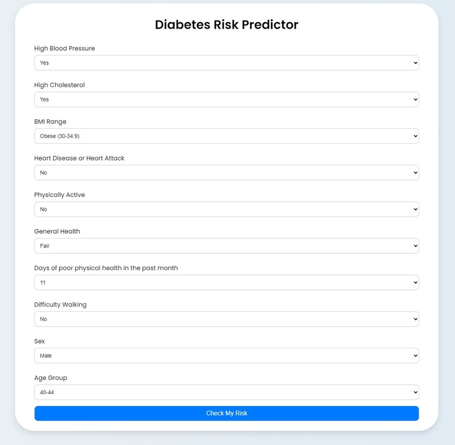

# ml-diabetes-risk-estimator

A machine learning web app that predicts a user's risk of contracting diabetes based on health data they input. The risk prediction is powered by a machine learning model trained on a dataset of over 250,000+ patient records.

**Live Demo:** [(link)](https://ml-diabetes-risk-estimator.onrender.com/)

## How It's Made:
**Tech used:** Python, Flask, scikit-learn, HTML, CSS
This project uses a Random Forest Classifier trained on a cleaned diabetes dataset. I first selected key health indicators such as blood pressure, BMI, cholesterol, and physical activity. After preprocessing and scaling the data, I trained the model using scikit-learn. The Flask framework was used to build a simple front-end interface where users can submit their information and receive a real-time risk score prediction. Everything is deployed using Render.

